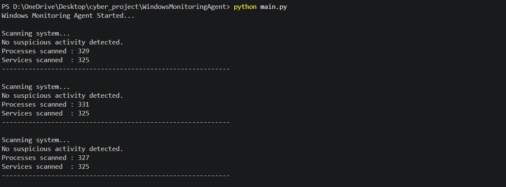

# Windows Process and Service Monitoring Agent

## Overview

The Windows Process and Service Monitoring Agent is a Python-based cybersecurity project that continuously monitors running processes and Windows services on a Windows system. The monitoring agent applies rule-based detection techniques to identify suspicious activities and generates alerts for potential security threats.

This project was developed as part of a cybersecurity internship to demonstrate host-based monitoring and basic intrusion detection techniques.

---

## Features

- Real-time process monitoring
- Windows service monitoring
- Suspicious folder detection
- Blacklisted process detection
- Process name spoofing detection
- Parent-child process relationship detection
- Alert logging
- Continuous monitoring
- Rule-based detection engine

---

## Detection Rules

The monitoring agent currently implements the following security rules:

### Process Detection

- Detects executables running from suspicious folders
  - Temp
  - Downloads
  - Desktop

- Detects blacklisted processes

- Detects possible process name spoofing

- Detects suspicious parent-child process relationships

### Service Detection

- Detects services with missing executable paths

- Detects services running from suspicious locations

- Detects automatically started services from suspicious directories

- Detects services running from user-writable directories

---

## Project Structure

```
WindowsMonitoringAgent/
│
├── detector.py
├── logger.py
├── main.py
├── process_monitor.py
├── service_monitor.py
├── report.py
│
├── logs/
│   └── alerts.log
│
└── README.md
```

---

## Technologies Used

- Python 3
- psutil
- WMI
- pywin32

---

## Installation

Clone the repository

```bash
git clone https://github.com/shitalbasnet/Windows-Monitoring-Agent.git
```

Move into the project directory

```bash
cd Windows-Monitoring-Agent
```

Install the required packages

```bash
pip install psutil WMI pywin32
```

---

## Running the Project

Start the monitoring agent

```bash
python main.py
```

The monitoring agent continuously scans the system every few seconds and reports any suspicious activities.

---

## Sample Output




## Screenshots

### Process Monitoring


### Service Monitoring


### Parent-Child Detection


### Alert Log


---

## Future Improvements

- Digital signature verification
- Threat intelligence integration
- YARA rule support
- Email alert notification
- Web dashboard
- Machine learning based anomaly detection

---

## Author

**Shital Basnet**

Cybersecurity Student

---

## License

This project is intended for educational and learning purposes.
